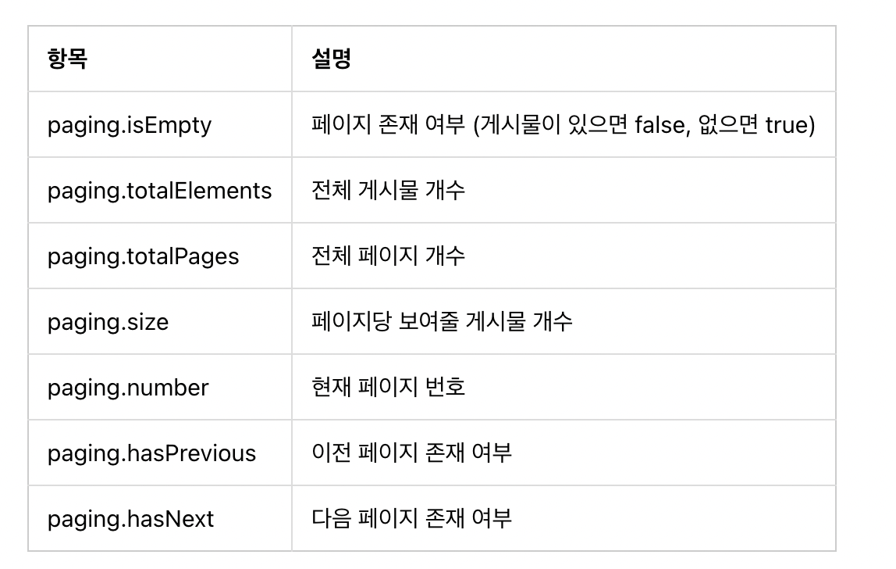

# [220819] idea_13팀 회고

## 팀 구성원

> [팀장] 권종석, 김아름, 박다정, 박중현, 박정원

## 회고 내용 요약 (최소 500자 이상)

## 부트스트랩
- 디자이너 도움 없이 웹 페이지를 만들 수 있게 도와주는 프레임워크
~~~
<link rel="stylesheet" type="text/css" th:href="@{/bootstrap.min.css}">
~~~

- 부트스트랩 클래스 표로 정리
  

## 템플릿 상속
- 재활용 되는 HTML을 레이아웃 형태로 구조화하기
 
layout.html을 제작하고
~~~
<html layout:decorate="~{layout}">

    <table class="table">
        (... 생략 ...)
    </table>

</html>
~~~
 

~~~
layout:fragment="content"
~~~
코드를 사용하여 부모 템플릿의 th:block 엘리먼트의 내용이 자식 템플릿의 div 엘리먼트의 내용으로 교체된다.

## Spring Boot Validation
화면에서 전달받은 입력 값을 검증
- 라이브러리 추가
~~~
implementation 'org.springframework.boot:spring-boot-starter-validation'
~~~

- 예시로 QuestionForm.java로 폼 클래스 제작

~~~
package com.mysite.sbb.question;

import javax.validation.constraints.NotEmpty;
import javax.validation.constraints.Size;

import lombok.Getter;
import lombok.Setter;

@Getter
@Setter
public class QuestionForm {
    @NotEmpty(message="제목은 필수항목입니다.")
    @Size(max=200)
    private String subject;

    @NotEmpty(message="내용은 필수항목입니다.")
    private String content;
}
~~~

- 컨트롤러에서 QuestionForm을 사용하도록 수정하기
  - BindingResult 사용

~~~
    @PostMapping("/create")
    public String questionCreate(@Valid QuestionForm questionForm, BindingResult bindingResult) {
        if (bindingResult.hasErrors()) {
            return "question_form";
        }
        this.questionService.create(questionForm.getSubject(), questionForm.getContent());
        return "redirect:/question/list";
    }
~~~

- bindingResult.hasErrors() -> 오류가 있는 경우 다시 폼을 작성하는 화면을 렌더링하고 오류가 없을 경우에는 질문 등록이 진행

## 페이징

~~~
org.springframework.data.domain.Page
org.springframework.data.domain.PageRequest
org.springframework.data.domain.Pageable
~~~
Page 객체의 속성

## 스프링 시큐피티
스프링 기반 애플리케이션의 인증과 권한을 담당하는 스프링 하위 프레임워크
- 인증(Authentication) : 로그인
- 권한(Authorize)은 인증되ㅐㄴ 사용자가 어떤 것을 할 수 있는지 의미

~~~
implementation 'org.springframework.boot:spring-boot-starter-security'
implementation 'org.thymeleaf.extras:thymeleaf-extras-springsecurity5'
~~~

>CSRF
>  
> 웹사이트 취약점 공격 방지를 위해 사용되는 기술로 CSRF 토큰 값을 세션을 통해 발행하고 웹 페이지에서 폼 전송시에 해당 토큰을 함께 전송하여 데이터 전달 검증하는 기술

 

SecurityConfig.java를 제작하여 스프링 시큐리티를 적용할 수 있다
~~~
@Configuration
@EnableWebSecurity
public class SecurityConfig {
    @Bean
    public SecurityFilterChain filterChain(HttpSecurity http) throws Exception {
        http.authorizeRequests().antMatchers("/**").permitAll()
            .and()
                .csrf().ignoringAntMatchers("/h2-console/**")
            .and()
                .headers()
                .addHeaderWriter(new XFrameOptionsHeaderWriter(
                        XFrameOptionsHeaderWriter.XFrameOptionsMode.SAMEORIGIN))
            ;
        return http.build();      
    }
}
~~~

## 회고 과정에서 나왔던 질문 (최소 200자 이상)
부트스트랩을 다운하는 것과 cdnjs를 사용할 때의 장단점

http://localhost:8080/bootstrap.min.css
- 장점: 개발하는 곳의 인터넷이 연결이 되어 있지 않아도 개발이 가능하다
- 단점 : 귀찮지만 다운로드가 필수

https://cdnjs.cloudflare.com/ajax/libs/bootstrap/5.2.0/css/bootstrap.min.css
- 장점 : 가져오기가 편하다.
- 단점 : 폐쇄망에서는 작동하지 않는다.

## 회고 인증샷 & 팀 자랑
