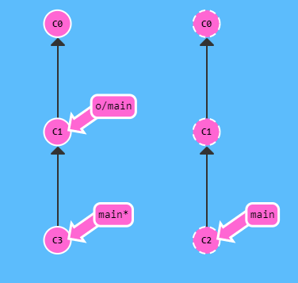
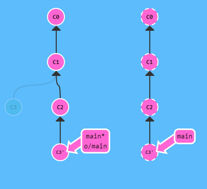
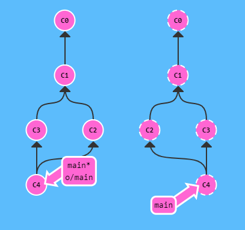
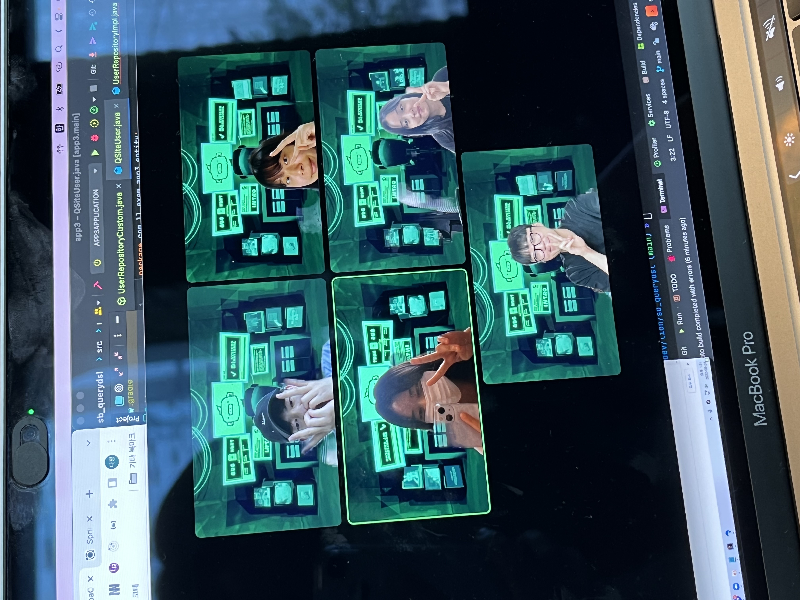

# [220826] idea_13팀 회고


## 팀 구성원

> [팀장] 권종석, 김아름, 박다정, 박중현, 박정원

## 회고 내용 요약 (최소 500자 이상)

## Git

### 원격 저장소 갱신으로 push가 불가능할 때


1. rebase 이용
```bash
git fetch;
git rebase origin main;
git push origin main;
```



2. merge 이용
```bash
git fetch;
fet merge origin main;
git push origin main;
```


3. pull 이용 (pull = fetch + merge)
    
    * ```
      git pull --rebase origin main;
      git push origin main;
      ```
      

    * ```
      git pull origin main;
      git push origin main;
      ```
      

## QueryDSL

정적 타입을 이용해서 SQL 등의 쿼리를 생성해주는 오픈소스 프레임워크<br>
SQL, JPQL을 코드로 작성할 수 있도록 도와주는 빌더 API

### 일반 JPA 함수의 장단점

* 장점 : 사용법이 단순
* 단점 : 복잡한 쿼리를 만들 수 없음

### QueryDSL 장단점

* 장점
  1. 복잡한 쿼리를 만들 수 있음
  2. 컴파일 시점에서 문법 오류를 쉽게 확인할 수 있음
  3. 쿼리 작성 시 제약 조건 등을 메서드 추출을 통해 재사용 가능

* 단점
    1. 코딩 양이 많아짐

### 설치 방법<br>
build.gradle 파일에 각 코드 추가
~~~
buildscript {
	ext {
		queryDslVersion = "5.0.0"
	}
}

plugins {
	//querydsl 추가
	id "com.ewerk.gradle.plugins.querydsl" version "1.0.10"
}

dependencies {
	//querydsl 추가
	implementation "com.querydsl:querydsl-jpa:${queryDslVersion}"
	annotationProcessor "com.querydsl:querydsl-apt:${queryDslVersion}"
}

//querydsl 추가 시작
def querydslDir = "$buildDir/generated/querydsl"

querydsl {
	jpa = true
	querydslSourcesDir = querydslDir
}

sourceSets {
	main.java.srcDir querydslDir
}

configurations {
	querydsl.extendsFrom compileClasspath
}

compileQuerydsl {
	options.annotationProcessorPath = configurations.querydsl
} 
~~~


## 회고 과정에서 나왔던 질문 (최소 200자 이상)
Q. QueryDSL, JPA 함수를 어떤 경우에 따라 사용해야 할까?<br>
A. 일반적인 쿼리는 JPA 함수를 이용해 해결하고 정말 복잡한 쿼리만 QueryDSL을 사용하여 해결
<br><br>
Q. git pull은 언제 해주는게 좋을까?<br>
A. push 이전에 pull을 통해 충돌사항이 없는지 확인 하고, 수시로 원격지와의 코드상황을 동일하게 해주면 좋음

## 회고 인증샷 & 팀 자랑

