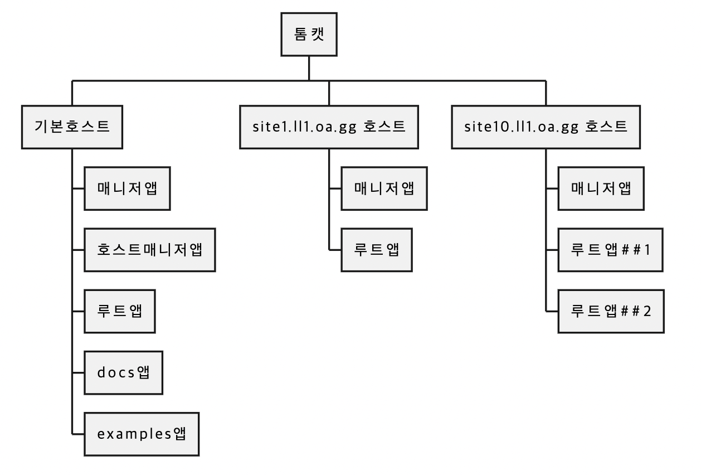

# [220907] idea_13팀 회고


## 팀 구성원

> 권종석, 김아름, 박다정, 박중현, 박정원

## 회고 내용 요약 (최소 500자 이상)

## 인프라

### Jar 파일의 종류

> **Jar (Java ARchive)** : 자바로 개발한 기능 모듈, 자바 애플리케이션을 실행하기 위한 클래스 파일, 이미지 파일, 소리 파일 등 다양한 종류의 파일이 포함
>
- executable jar

  그 자체로 실행 가능
  실행에 필요한 것들을 압축파일 안에 많이 넣을 수록, 점점 더 다양한 환경에서 실행 가능

- lib jar

  그 자체로 실행파일이 아닌 경우가 많음
  보통 다른 프로젝트에 종속되어 사용됨
  lib들은 종속성 TREE로 묶임

- war

  executable jar의 한 종류로 톰캣이 빠져있음 → 어차피 war는 톰캣내부에 삽입되기 때문
  스프링 부트에서는 프로그램 배포 시 jar, war 2개의 선택지 존재


### 톰캣 구조도


- 톰캣 구성요소
- 톰캣 : 웹앱을 탑재할 수 있는 컨테이너, 여러개의 호스트를 추가할 수 있고, 설치 직후에는 기본 호스트만 존재
- 기본 호스트 : 설치 직후에는 기본적으로 5개의 앱을 가지고 있음
- 매니저앱 : 각 호스트마다 하나씩 존재, 자신이 속한 호스트에서 소속된 다른 앱들을 관리하는데 사용, 원격 배포시에 사용
- 호스트 매니저앱 : 톰캣당 1개씩 존재, 호스트를 추가, 삭제할 수 있음
- docs앱 : 톰캣 공식 문서가 담겨있는 앱
- examples앱 : 톰캣 예제 소스코드가 담겨있는 앱
- 앱의 URL 구성 : 호스트/앱 이름
- 루트앱: 호스트명만으로 구성된 URL로 접속했을 때 나오는 앱
- 보통 톰캣에 새로운 사이트를 추가할 때, 호스트매니저로 호스트를 추가한 후, 해당 호스트안에 루트앱만 추가
- 병렬배포 → 버전을 달리하면 똑같은 앱이 하나의 호스트 내에 여러개 존재 가능 → 사용자가 접근했을 때 톰캣이 버전이 높은 앱 노출

## 스프링부트

### 스프링 시큐리티 로그인

- UserDetails
  : 시큐리티가 /login 주소 요청이 오면 낚아채서 로그인을 진행하는데 로그인 진행이 완료되면 시큐리티 세션을 만들어줌. 세션의 키 값은 Security ContextHolder이고 값은 Authentication 타입의 객체입니다. Authentication 타입 객체에는 User 정보가 담겨 있어야 하는데 그 User정보는 UserDetails 타입 객체에 담겨 있음. 

  - UserDetails : 시큐리티에서 제공하는 인터페이스입니다.
  - getAuthorities() : User의 권한을 리턴을 합니다.
  - getPassword() : User의 비밀번호를 리턴을 합니다.
  - getUsername() : User의 아이디를 리턴을 합니다.
  - isAccountNonExpired() : 계정이 만료되었는지 여부를 리턴합니다.
  - isAccountNonLocked() : 계정이 잠겼는지 여부를 리턴합니다.
  - isCredentialsNonExpired() : 계정의 비밀번호가 오래 사용했는지에 대한 여부를 리턴합니다.
  - isEnabled() : 계정의 활성화 여부를 리턴합니다.
  
- UserDetailsService
: 시큐리티 설정에서 loginProcessingUrl("/login")으로 요청이 오면 자동으로 UserDetailsService 타입으로 Ioc가 되어있는 loadUserByUsername함수가 실행됨.
  
  - loadUserByUsername의 함수에서 매개 변수인 username은 html일 경우 name=”username”과 동일해야함
  
- BCryptPasswordEncoder
: 비밀번호를 암호화, controller에 빈으로 등록된 BCryptPasswordEncoder를 자동으로 주입


#### 시큐리티 설정

```java
@Configuration
@EnableWebSecurity
public class SecurityConfig extends WebSecurityConfigurerAdapter {

    @Bean
    public BCryptPasswordEncoder encodePwd() {
        return new BCryptPasswordEncoder();
    }

    @Override
    protected void configure(HttpSecurity http) throws Exception {
        http.csrf().disable();
        http.authorizeRequests()
                .antMatchers("/user/**").authenticated()
                .antMatchers("/manager/**").access("hasRole('ROLE_ADMIN') or hasRole('ROLE_MANAGER')")
                .antMatchers("/admin/**").access("hasRole('ROLE_ADMIN')")
                .anyRequest().permitAll()
                .and()
                .formLogin()
                .loginPage("/loginForm")
                .loginProcessingUrl("/login") 
                .defaultSuccessUrl("/");
               
    }
}
```

#### 사용자 인증

```java
public class PrincipalDetails implements UserDetails {
    private User user;

    public PrincipalDetails(User user) {
        this.user = user;
    }

    @Override
    public Collection<? extends GrantedAuthority> getAuthorities() {
        Collection<GrantedAuthority> collection = new ArrayList<>();
        collection.add(new GrantedAuthority() {
            @Override
            public String getAuthority() {
                return user.getRole();
            }
        });
        return collection;
    }

    @Override
    public String getPassword() {
        return user.getPassword();
    }

    @Override
    public String getUsername() {
        return user.getUsername();
    }

    @Override
    public boolean isAccountNonExpired() {
        return true;
    }

    @Override
    public boolean isAccountNonLocked() {
        return true;
    }

    @Override
    public boolean isCredentialsNonExpired() {
        return true;
    }

    @Override
    public boolean isEnabled() {
        return true;
    }
}
```

```java
@Service
public class PrincipallDetailsService implements UserDetailsService {
    @Autowired
    private UserRepository userRepository;

    @Override
    public UserDetails loadUserByUsername(String username) throws UsernameNotFoundException {
        User user = userRepository.findByUsername(username);
        if(user != null) {
            return new PrincipalDetails(user);
        }
        return null;
    }
}
```


## 회고 과정에서 나왔던 질문 (최소 200자 이상)
Q. JAR와 WAR의 차이점<br>
```text
💡 JAR
- Class와 같은 JAVA 리소스와 속성 파일, 라이브러리 및 액세서리 파일이 포함
- JAVA 애플리케이션이 동작할 수 있도록 자바 프로젝트를 압축한 파일

💡 WAR
- 웹 관련 자원만 포함하고 있으며 이를 사용하면 웹 어플리케이션을 쉽게 배포하고 테스트 가능
```
- WAR 파일도 JAVA의 JAR 옵션(java -jar)을 이용해 생성하는 JAR 파일의 일종으로 웹 어플리케이션 전체를 패키징하기 위한 JAR 파일이다.

## 회고 인증샷 & 팀 자랑

