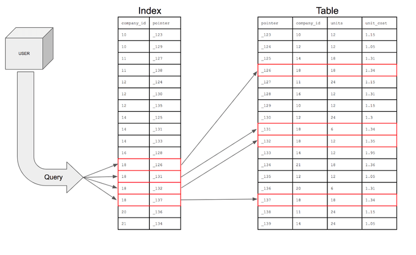
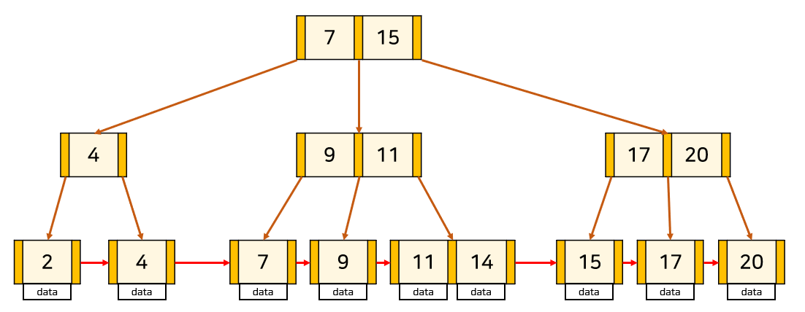

# [220916] idea_13팀 회고


## 팀 구성원

> 권종석, 김아름, 박다정, 박중현, 박정원

## 회고 내용 요약 (최소 500자 이상)

---

## Index의 필요성

**RDBMS에서 검색 속도를 높이기 위한 자료구조**

**Index**는 **_DB_** 분야에 있어서 테이블에 대한 동작의 속도를 높여주는 자료 구조이다.

음반(music)

| row id | 제목 | 가수 | 발매일 |
| --- | --- | --- | --- |
| 1 | aaaaaa | a | 2022.03.04 |
| 2 | bbbbbb | e | 2021.03.03 |
| 3 | cccccc | b |   |
| … |   |   |   |
| 52222 | dddddd | b | 2021.03.03 |
| 52223 | eeeeee | a | 2021.03.03 |
| 52224 | ffffffff | b | 2021.03.03 |
| … |   |   |   |
| 99999 | ggggggg | c | 2021.03.03 |
| 100000 | hhhhhhh | d | 2021.03.03 |

어떤 사람이 가수가 a인 모든 음반을 구매하려고 한다고 가정하자!

```
SELECT * FROM music
WHERE 가수 = 'a';
```

index가 없는 경우, 100000개의 데이터를 하나하나 모두 뒤져서 결과를 찾는다.

이 방식을 **Full Table Scan**이라고 한다.

실제 회사에서는 기본적으로 10만개, 100만개가 넘는 데이터를 다루기 때문에 이를 full table scan 방식을 이용하게 된다면 상당히 비효율적이다.

index가 들어가게 된다면, 가수를 기준으로 인덱스 정렬을 한다.(Range Scan)

| row id | 제목 | 가수 | 발매일 |
| --- | --- | --- | --- |
| 1 | aaaaaa | a | 2022.03.04 |
| 52223 | eeeeee | a | 2021.03.03 |
| 3 | cccccc | b |   |
| 52222 | dddddd | b | 2021.03.03 |
| 52224 | ffffffff | b | 2021.03.03 |
| … |   |   |   |
| … |   |   |   |
| 99999 | ggggggg | c | 2021.03.03 |
| 100000 | hhhhhhh | d | 2021.03.03 |
| 2 | bbbbbb | e | 2021.03.03 |

인덱스는 가수를 기준으로 정렬되어 있기 때문에 ‘a’를 계속 검색하다가 그다음 ‘b’를 만나는 순간, 더이상 ‘a’가수의 음반은 존재하지 않는다고 생각하고 탐색을 종료한다.

**인덱스를 만드는 이유는 row id를 기준으로 데이터를 탐색할 수 있도록 유도해서 쿼리의 성능을 향상시키기 위함이다!**



---

## 인덱스의 장단점

1.  장점
    -   테이블을 조회하는 속도와 그에 따른 성능을 향상할 수 있다.
    -   전반적인 시스템 부하를 줄일 수 있다.
2.  단점
    -   인덱스 관리를 위해 DB의 약 10%에 해당하는 저장공간이 필요하다.
    -   추가 작업이 필요하다 → 인덱스의 관리가 필요
    -   작업(crud)가 빈번한 column에 인덱스를 걸게 되면 인덱스의 크기가 커져서 성능이 오히려 저하될 수 있다.

---

## 인덱스의 관리

DBMS에서는 index가 항상 최신의 데이터를 가지고 있을 수 있도록 관리한다.

`INSERT` : 새로운 데이터에 대한 인덱스를 추가함

`DELETE` : 더이상 해당 데이터의 인덱스를 사용하지 않도록 작업

`UPDATE` : 기존의 인덱스를 사용하지 않음 처리, 갱신된 데이터의 인덱스 추가

→ 인덱스가 적용된 column에 해당 작업이 수행된다면, 매번 다음과 같은 연산을 추가적으로 진행해줘야한다. 오버헤드가 발생한다!

---

## 인덱스를 사용하면 좋은 경우

1.  규모가 작지 않은 테이블
2.  INSERT, DELETE, UPDATE가 자주 발생하지 않는 column
3.  JOIN, WHERE, ORDER BY에 자주 사용되는 컬럼
4.  데이터의 중복도가 낮은 컬럼

---

## Index의 자료구조

1.  B-tree
    -   자식 노드가 최소 두개 이상이다
    -   Root Node, Branch Node, Leaf Node로 구성된다




-   특성

    -   leaf node만 인덱스와 함께 데이터를 가지고 있고, 나머지 인덱스 노드들은 데이터를 위한 인덱스(key)만 갖는다.
    -   leaf node들은 LinkedList로 연결되어 있다.
    -   Root Node에서 경로를 확인한 후 그에 맞는 노드로 이동하여 최종적으로 원하는 데이터가 있는 Leaf Node에 도착한다.

    -   인덱스의 운행방식- 수직적으로 조건을 만족하는 첫번째 레코드를 찾아 들어간 후 leaf node에서 수평적으로 조건을 만족하는 node를 찾는다.

## 회고 과정에서 나왔던 질문 (최소 200자 이상)

인덱스의 종류와 차이점?
### `Clusted Index(클러스터형 인덱스)`
- 테이블당 한 개만 생성이 가능하다.

- 행 데이터를 인덱스로 지정한 열에 맞춰서 자동 정렬된다

- primary 키 설정 시 자동으로 생성되며 컬럼은 데이터 변경시, 항상 정렬을 유지합니다.


### `Non-Clustered Index(비클러스터형 인덱스)`
- 테이블당 여러 개를 생성할 수 있다.

- 테이블의 페이지를 정렬하지 않고 새로운 공간을 할당하므로, 클러스터 인덱스보다 많은 공간을 차지한다.

- 데이터 행과 분리된 구조를 가진다


## 회고 인증샷 & 팀 자랑


저희 팀은 질문에 있어서 망설임이 없습니다!

한번 단체 회식을 한 경험이 있어서 내적 친밀감이 상당히 강력한 상태이고.. 다들 굉장히 귀엽습니다.

일주일마다 한번씩 회고팀자랑 사진을 찍을 때 포즈를 정하기로 했는데, 이번에는 하트모양컨셉이었습니다

다른 편도 기대해주세요 !
