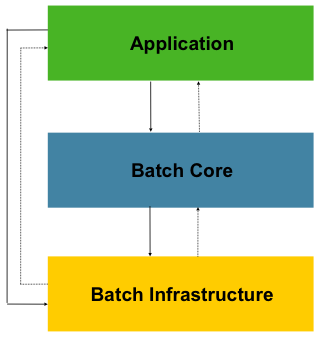

# [220923] idea_13팀 회고


## 팀 구성원

> 권종석, 김아름, 박다정, 박중현, 박정원

## 회고 내용 요약 (최소 500자 이상)

---

## 도커

### 도커의 필요성

어플리케이션을 실행하기 위해서는 많은 소프트웨어들을 실행해야 한다. 하지만 필요한 소프트웨어의 종류가 많아질수록 필요한 컴퓨터의 개수가 많아져 낭비가 우려된다.
이러한 문제점을 해결하기 위해 가상머신(virtual machine)을 개발하여 가상의 컴퓨터를 사용할 수 있다.
그러나 역시, 가상머신 또한 실행 속도 면에서는 약점들이 많다. 
결국 격리된 환경에서 실행을 해야 하는데 여기서 고안된게 '컨테이너'이다.
컨테이너는 가상머신과 달리 전체 운영체제가 설치되는 것이 아닌 해당 소프트웨어를 실행하는데 필요한 라이브러리와 실행 파일만을 포함한다.
이렇게 함으로써 기존 운영체제를 공유할 수 있게 되어 운영체제를 설치할 필요도 없고, 속도 면에서도 이득을 볼 수 있다.

이 컨테이너 기술의 대표가 되는 기술이 '도커'다


### image 
이미지는 컨테이너를 정의하는 읽기 전용 템플릿이며 컨테이너가 실행되기에 필요한 라이브러리와 종속성이 포함되어 있다.
하나의 이미지에 여러개의 컨테이너가 생성될 수 있으며, 컨테이너 상태가 변해도 이미지는 변하지 않는다. 

즉, 컨테이너는 인스턴스화된 (실행이된) Docker의 이미지라고 볼 수 있다. 
만약 서버를 확장해야 한다면, 단순히 이미지를 추가해서 컨테이너를 생성하면 된다.

### 도커 명령어

도커 설치

```
sudo yum install -y yum-utils

sudo yum-config-manager --add-repo https://download.docker.com/linux/centos/docker-ce.repo

sudo yum install docker-ce docker-ce-cli containerd.io docker-compose-plugin -y

sudo systemctl start docker

sudo systemctl enable docker
```

image
```
docker pull 이미지명 // 다운로드

docker rmi -f 이미지명 // 삭제

docker images // 목록

```

조회
```
조회 : docker ps

현재 실행중인 컨테이너 목록

전체조회 : docker ps -a

종료된 컨테이너도 표시

```

도커 삭제
```
# 컨테이너 삭제
docker rm -f $(docker ps -qa)

# 이미지 삭제
docker rmi -f $(docker images -qa)

# 안쓰는 네트워크 삭제
docker network prune -f

# 안쓰는 볼륨 삭제
docker volume prune -f

# 도커 프로젝트 삭제
sudo rm -rf /docker/projects
sudo rm -rf /docker_projects
```

---

## 젠킨스

### 젠킨스 개념
젠킨스는 소프트웨어 개발 시 지속통합 서비스를 제공하는 툴이다.

CI가 필요한 이유는 버그를 신속하게 찾아서 해결하여 소프트웨어 품질을 향상시키고 새로운 업데이트를 검증하고 릴리즈 시간을 단축시키는 것이다.

CD가 필요한 이유는 소프트웨어가 신뢰 가능한 수준의 버전을 유지할 수 있도록 지속적으로 서비스를 제공하고 배포를 해주는 것이다.

젠킨스는 소스의 커밋을 감지하여 자동적으로 자동화 테스트가 포함된 빌드가 작동되도록 설정을 해준다.

이러한 빌드 자동화를 통해 CI와 CD를 더 효율적으로 할 수 있다는 장점이 있다.

---

## 스프링 배치

### 스프링 배치 개념

스프링 배치는 대용량 일괄처리의 편의를 위해 설계된 가볍고 포괄적인 배치 프레임워크다. 
Spring의 결을 그대로 따라 DI, AOP, 서비스 추상화 등 Spring 프레임워크의 3대 요소를 모두 사용할 수 있다.

비즈니스 데이터가 너무 많고 복잡한 작업으로 처리해야 하는 경우와 특정 시점에 스케줄러를 통해 자동화된 작업이 필요한 경우에 사용이 된다.



개발자는 배치의 동작과 관련된 부분은 Batch Core에 있는 클래스들을 이용하여 제어할 수 있다


**JobRepository**

다양한 배치 수행과 관련된 수치 데이터와 잡의 상태를 유지 및 관리할 수 있다.
일반적으로 관계형 데이터베이스를 쓰면 스프링 배치 내의 대부분 주요 컨포넌트가 공유한다.
실행된 Step, 현재 상태, 읽은 아이템 및 처리된 아이템 수 모두 JobRepository에 저장이 된다.

**Job**

Job은 배치 처리 과정을 하나의 단위로 만들어 표현한 객체이고 여러 Step 인스턴스를 포함하는 컨테이너다
Job이 실행될 대 스프링 배치의 많은 컴포넌트가 탄력성을 제공하기 위해 서로 상호작용 한다

**JobLauncher**

Job을 실행하는 역할을 담당한다.
Job 재실행 가능 여부, 잡 실행 방법, 파라미터 유효성 검증 등을 수행한다
스프링 부트의 환경에서는 부트가 Job을 시작하는 기능을 제공하기 때문에 일반적으로 직접 조작할 필요는 없다.

**Step**

스프링 배치에서 가장 일반적으로 상태를 보여주는 단위다.
각 Step은 Job을 구성하는 독립된 작업 단위이다. 


## 회고 과정에서 나왔던 질문 (최소 200자 이상)

도커 기술의 단점은?
- 리눅스용 소프트웨어만 지원한다
- 호스트 서버에 문제가 생기면 그와 연관된 모든 컨테이너에 영향이 간다
- 컨테이너 하나를 장기간에 걸쳐 사용하면 딱히 이득을 볼 수 없다 -> 컨테이너를 최대한 분산하도록


## 회고 인증샷 & 팀 자랑


당신의 안목팀 화이팅~!🔥🔥

