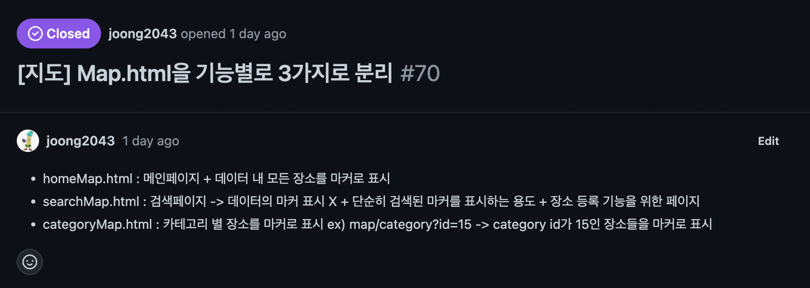

# [1주차] idea_13팀 진행상황 공유

## 📍 팀 구성원, 개인별 역할

- 권종석[팀장] : DB 설계, 로그인 구현
- 김아름 : 지도에서 장소 선택지 장소 관련 정보 팝업 구현
- 박다정 : 번개 모임 관련 페이지 구현
- 박중현 : 지도 구현
- 박정원 : 카테고리 페이지 구현

 

## 📍 팀 내부 회의 진행 회차 및 일자

1. 1회차(2022.08.01) - 디스코드 회의 진행 (박정원님 불참)
2. 2회차(2022.08.02) - 디스코드 회의 진행
3. 3회차(2022.08.03) - 디스코드 회의 진행
4. 4회차(2022.08.04) - 디스코드 회의 진행
5. 5회차(2022.08.05) - 디스코드 회의 진행
6. 6회차(2022.08.08) - 디스코드 회의 진행

## 📍 현재까지 개발 과정 요약 (최소 500자 이상)

> 💬 1회차 
- 기능 구체화 → 구글 스프레드시트에 각자 한 task씩 맡아 진행
- 상세 기능에 대한 의견 논의 → 추가 기능이나 필요없다고 생각되는 기능에 대한 논의

> 💬 2회차 
- 기술 스택 선정

  ✔️ SpringBoot, Gradle, Java17, Spring JPA, Thymeleaf, Kakao Map API

> 💬 3회차 
- Task 분배
- 기능 상세화 → 구체화된 기능을 이해하기 쉽게 정리
- 기능 우선순위 정하기 → 필수 기능과 추가 기능 우선순위 분배
- 프로젝트 구조에 대한 논의 → Module 우선식 vs Layer 우선식

> 💬 4회차 
- Task의 상세 기능 재분배
- 깃허브 칸반보드, 백로그 작성하는 법에 대한 논의
- CI 구축, 프로젝트 구조에 대한 논의
- 프로젝트명에 대한 논의 → "**your anmok**"으로 결정

> 💬 5회차 
- 깃 브랜치 전략 결정

  ✔️ feature branch → feature/{issue-number}-{task-name} 형식 사용
- 패키지 구조 결정 → 모듈 우선 방식을 채택

> 💬 6회차 
- 상세 기능에 대한 논의 → 사용자 리뷰 입력 시 대상자에 대한 논의
- 회고 작성 순서 결정
- 템플릿 사용에 대한 논의 → 템플릿을 직접 사용해보고 난이도를 보아 프로젝트에 적용할 지 추후에 추가로 논의 예정

### ⭐️ **개발 진도** ⭐️

- 프로젝트 의존성 세팅
- Map : 메인화면 지도에 마커 생성, 카카오 맵 API 연결 + 지도 센터를 홍대로 설정
- Popup : 지도 화면 마커 클릭 시 팝업창 생성

 

## 📍 개발 과정에서 나왔던 질문 (최소 200자 이상)

1. 사용자가 장소에 대해 리뷰하는 기능의 대상자의 범위를 어떻게 지정해야 하는가

   ✔️ 장소를 추가한 사람만 리뷰를 작성할 수 있게 하면 데이터의 수가 적어 유용하지 못하다.  
   ✔️ 아무나 리뷰를 작성할 수 있게 하면 데이터의 신뢰성이 떨어질 수 있으므로 로그인 한 사용자만 리뷰를 할 수 있게 설정해야한다.

2. Task 분배는 어떻게 할 것인가?

   ✔️ 한 Part를 여럿이 나눠하게 되면 merge과정에 있어서 충돌이 발생할 가능성이 크다.
   ✔️ Task는 한 개의 part씩 나누어 개발하는 것이 좋을 것 같다.

## 📍 개발 결과물 공유

Github Repository URL: https://github.com/likelion-backendschool/your-anmok

