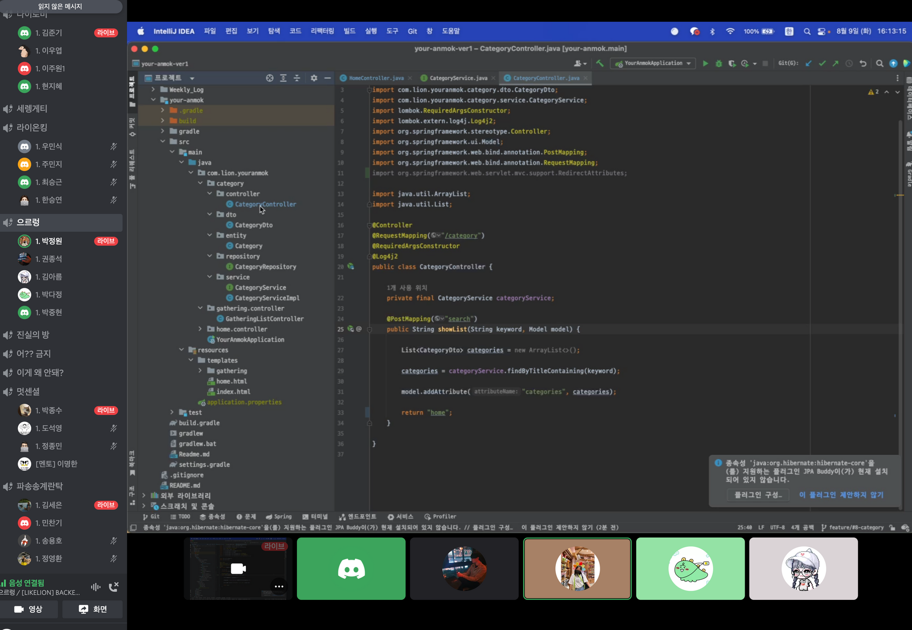

# [1주차] idea_13팀 진행상황 공유

## 📍 팀 구성원, 개인별 역할

- 권종석[팀장] : DB 설계, 카카오 로그인 구현
- 김아름 : 지도에서 장소 선택지 장소 관련 정보 팝업 구현
- 박다정 : 번개 모임 관련 페이지 구현
- 박중현 : 지도 구현
- 박정원 : 카테고리 페이지 구현

<br>

## 📍 팀 내부 회의 진행 회차 및 일자

7회차(2022.08.09) - 디스코드 회의 진행 (전원 참석)
8회차(2022.08.10) - 디스코드 회의 진행 (전원 참석)
9회차(2022.08.11) - 디스코드 회의 진행 (전원 참석)


## 📍 현재까지 개발 과정 요약 (최소 500자 이상)

> 💬 7회차<br>
- 각자 진행 상황 보고
- ### 중현님
  
  - 지도 전체화면에 보이게 생성, 내위치 찾기 버튼 생성 & 구현 완료
  - 마이로케이션 버튼을 어떻게 바꾸면 좋을지 논의 → GPS 아이콘을 넣기로 결정!
  - 처음 접속했을때 지도의 zoom 정도 논의 → 서울 전체로 하는게 좋은듯

- ### 다정님
  
  
  - gathering/list 입력시 화면 레이아웃 배치 구현
  - html파일 상으로는 보이는데 local에서 실행하면 렌더링이 안되고 깨지는 오류 있어서 강사님께 질문해야함

- ### 아름님
  
  
    - 지도에서 마커를 클릭 시 팝업창이 뜨고, x버튼을 누르면 닫히게까지 구현
    - x버튼 말고도, 팝업창이 아닌 다른 창(지도화면) 클릭 시 닫히면 좋을 것 같다는 피드백 받음

- ### 정원님
  
    - Controller, html파일의 배치 위치에 대해서 질문하심.
    - category안에서의 서브메인화면과 category의 controller를 분리해서 작업했는데 이 controller의 부모디렉토리를 어디에저장해야 하는지에 대한 질문
      - 다정님 : 서브메인과 카테고리 또한 category의 큰 범주중 하나라고 할 수 있기 때문에 Controller 둘 다 category 안에 구현하는 것이 좋을 것 같다고 답변

- ### 종석님
  
    - 데이터베이스 ERD 설계 및 공유(피드백)
    - 테이블 네이밍, 빠진 column들 피드백 받고 수정 완료 -> 우선 이대로 멘토님 피드백 받기로 함!

- ### 지애 멘토님 피드백 받음
  
  - 피드백 내용
    1. 유저 테이블에서 비밀번호를 넣는 건 어떨까?
    2. 권한(관리자, 유저), 탈퇴여부 not null 처리하기
    2. 생성, 수정 column같은 경우엔 datetime을 사용해야 한다.
    3. 조회수 기능이 있으면 좋을듯
    4. 디비 스키마 공유해준다고 하심 → 해당 url ERD설계 페이지에 있습니다!!


> 💬 8회차<br>
- 브랜치 전략 확정
- 깃허브에서의 이슈를 어떻게 도입할것인지(종석님 제안)

- ### 지애멘토님 추가 피드
  - Q1. loginpw와 같이 유저 관련필드를 추가해야 하는지?
    - 회원관리 (로그인/로그아웃/회원가입/연동 등) 수단으로 소셜 로그인만 적용하실거라면 type으로 kakao_와 같이 붙여서 테이블을 따로 분리해 카카오로그인 정보를 저장하거나, user 테이블에 카카오로그인 관련 정보의 필드를 추가해주시는 것도 괜찮을 것 같습니다. 나중에 혹시 관리자 권한으로 데이터를 다뤄야 할지 모르니 고려해보시면 좋을 것 같네요.
    - [https://github.com/jiin-coder/sb_c_2022/blob/master/DB/schema.sql](https://github.com/jiin-coder/sb_c_2022/blob/master/DB/schema.sql)

- ### 각자 작업한 브랜치 develop에 합치는 방법 미니 스터디
  1. git branch -r
   
  2. git checkout -t origin/development
  
  ```shell
    g-t : 원격 브랜치명과 로컬 브랜치명이 동일하게 생성되고 checkout
    // git checkout -b [생성할브랜치명] [원격브랜치명]
    ```
  3. git merge [브랜치명]
  
  4. git remote update / git fetch [브랜치명] (dev 브랜치 최신화)

> 💬 9회차<br>
- 아름님 ERD 질문
  - rate_cnt와 star 필드의 연관성에 대한 질문
- **pull request 형식확정**
: [번개 | 카테고리 | 지도 | 팝업 | 로그인] 내용


<br>

## 📍 개발 과정에서 나왔던 질문 (최소 200자 이상)

1. ERD에서 rate_cnt와 star 필드의 연관성에 대한 질문

   ✔️ star 필드에서는 별점 평균을 저장하고, rate_cnt 필드에서는 총 평가한 인원수를 저장해 새로운 리뷰어가 생겼을 경우 각각의 필드를 업데이트 해준다. 
   
    ✔️ 리뷰어가 추가될때마다 연산을 두번해야한다는 점에서 불편하지 않을까 하는 피드백, 추후 논의하기로 함!
<br/>
<br/>
2. category안에서의 서브메인화면과 category의 controller를 분리해서 작업했는데 이 controller의 부모디렉토리를 어디에저장해야 하는지에 대한 질문

  ✔️ 서브메인과 카테고리 또한 category의 큰 범주중 하나라고 할 수 있기 때문에 Controller 둘 다 category 안에 구현하는 것이 좋을 것 같다고 답변

<br/>
  ✔️ 추후 작업시에도 다른 성격을 가지고 있다고 하더라도 큰 범주를 맞춰서 코드 배치에 혼란을 줄이기로 함! 


## 📍 개발 결과물 공유

Github Repository URL: https://github.com/likelion-backendschool/your-anmok

