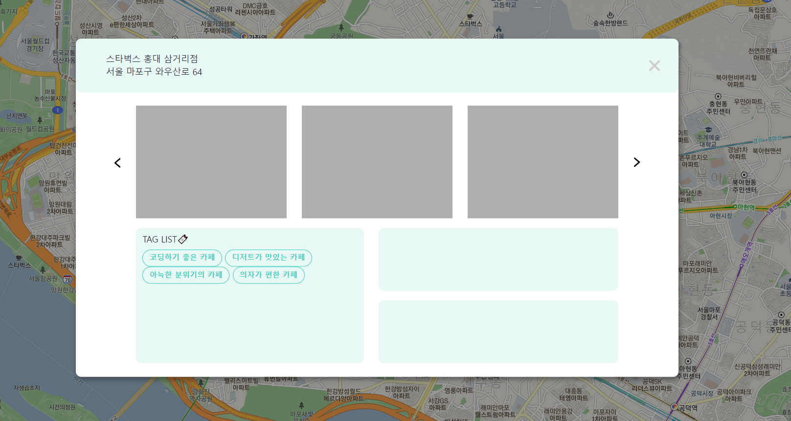

# [3주차] idea_13팀 진행상황 공유

 

## 📍 팀 구성원, 개인별 역할

- 권종석[팀장] : DB 설계, 카카오 로그인 구현
- 김아름 : 지도에서 장소 선택지 장소 관련 정보 팝업 구현
- 박다정 : 번개 모임 관련 페이지 구현
- 박중현 : 지도 구현
- 박정원 : 카테고리 페이지 구현

 

## 📍 팀 내부 회의 진행 회차 및 일자

11회차(2022.08.22) - 디스코드 회의 진행(전원 참석)

 

## 📍 현재까지 개발 과정 요약 (최소 500자 이상)

> 💬 10회차

- ### 종석님

  - 기존에 존재하던 스프링 시큐리지 인증 코드 삭제
  - 카카오에서 받아오는 정보 DB 저장
  - 카카오 서버의 회원 정보에 따른 로직 구현

- ### 정원님
  
  - 검색 키워드 존재 여부에 따라 다르게 호출되던 메서드를 하나로 통합
  - 번개 리스트 댓글순 정렬되어 노출되도록 작성
  - 번개 리스트 전체 페이지로 이동 버튼 생성
  - 각 컨텐츠 클릭 시 해당 페이지로 이동

- ### 중현님

    - map.html 파일 가이드라인에 따라 리팩토링
    - 키워드 검색 결과 리스트와 지도 위 마커 연동 → 리스트에 커서 hover 시 해당 마커에 표시

- ### 아름님
  
    - 장소, 태그명 정보를 담은 dto 파일 생성
    - 카테고리명 테스트 데이터 생성
    - 장소와 카테고리명 Join 쿼리를 통해 필요한 정보를 List 형태로 받아와 팝업에 노출
    - 태그 클릭 시 해당 카테고리의 마커를 보여주는 지도로 이동 가능하도록 버튼으로 생성

- ### 다정님
  
    - DB에 저장된 데이터 중 번개 상세 페이지의 장소 정보, 모임 정보 불러와서 페이지에 노출
    - 댓글 리스트 생성
    - 답댓글 버튼 생성 및 클릭 시 답댓글 작성 폼 노출

 

## 📍 개발 과정에서 나왔던 질문 (최소 200자 이상)

Q. Git에서 merge 및 PR을 할 때 마지막 merge 이후 추가된 커밋에 대해서만 커밋 메세지가 나와야 하는데 이전에 작업을 모두 완료하여 main 브랜치에 병합한 커밋 내역까지 모두 나타나는 문제 해결 방법

✔️ 멘토님께 질문 후 답변 기다리는 중

Q. Git branch 최신 상태 반영이 안될 때

✔️git reset --hard origin/development 를 통해 branch의 HEAD를 동일하게 설정한 후 pull 하여 해결
️
 

## 📍 개발 결과물 공유

Github Repository URL: https://github.com/likelion-backendschool/your-anmok

 