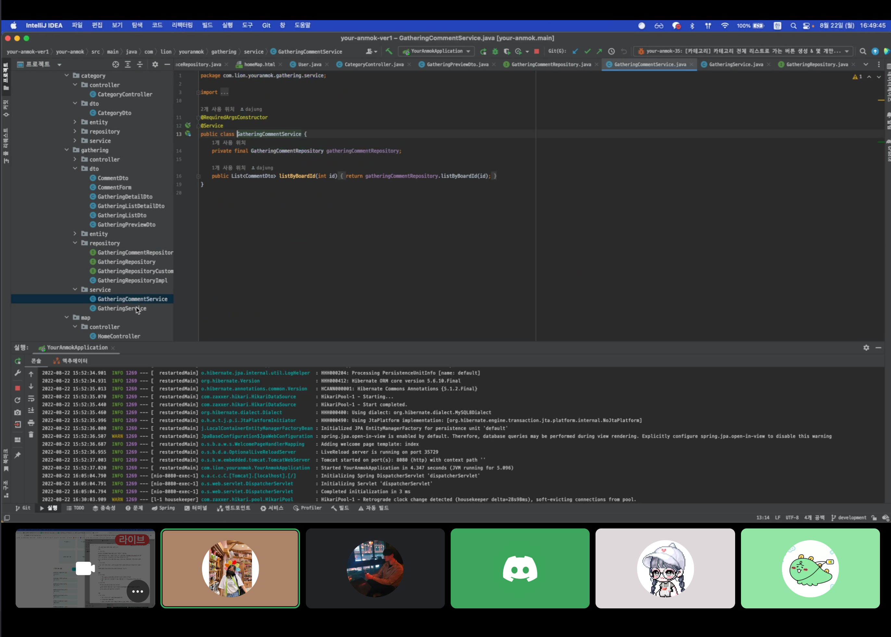
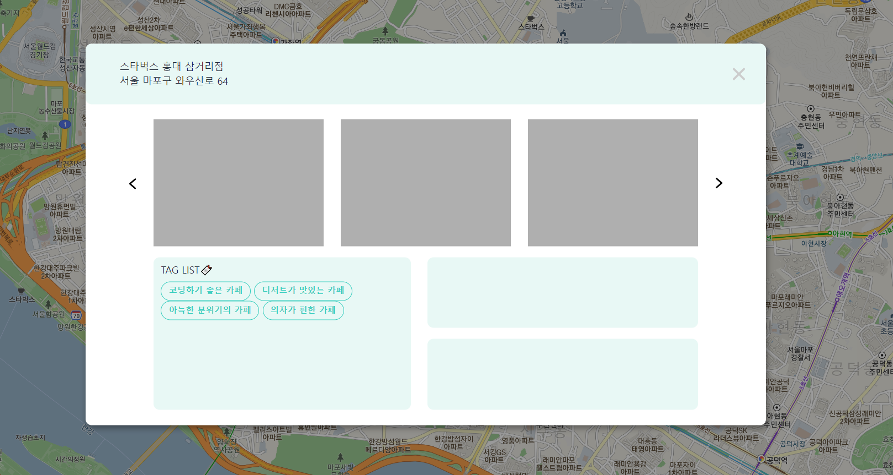
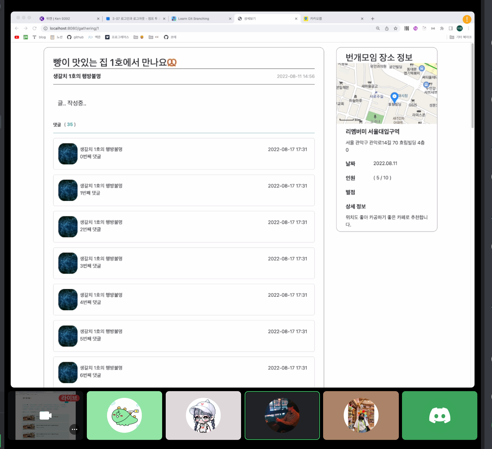

# [4주차] idea_13팀 진행상황 공유

 

## 📍 팀 구성원, 개인별 역할

- 권종석[팀장] : DB 설계, 카카오 로그인 구현
- 김아름 : 지도에서 장소 선택지 장소 관련 정보 팝업 구현
- 박다정 : 번개 모임 관련 페이지 구현
- 박중현 : 지도 구현
- 박정원 : 카테고리 페이지 구현

 

## 📍 팀 내부 회의 진행 회차 및 일자

12회차(2022.08.29)

 

## 📍 현재까지 개발 과정 요약 (최소 500자 이상)

> 💬 11회차

- ### 종석님

  - 카카오 로그인 코드 리펙토링
  - 카카오에서 받아오는 정보 DB 저장, 카카오 서버의 회원 정보에 따른 로직 구현

- ### 정원님

  
  - 카테고리 검색 키워드 없을 때 페이지 이동시 데이터가 뜨지 않는 버그 수정
  - 유저 Id=0으로 고정시켜놓고 즐겨찾기 추가, 삭제 기능 구현
  - 카테고리 화면에 즐겨찾기 추가, 해제 시각적 표현 완료
  - 카테고리 즐겨찾기 등록 후 화면이 첫 페이지 화면으로 돌아가는 버그 수정
  - 해야할 일 : 카테고리를 즐겨찾기가 많은 순으로 sorting, 즐겨찾기 순으로 sorting하는 쿼리 부분에서 막혀서 계속 코드 수정중

- ### 중현님

    - 장소 검색 리스트에 장소 등록 버튼 생성 완료
    - 장소 등록 버튼 클릭시 DB에 장소 이름 저장
    - 해야할 일 : DB에 등록된 장소를 마커롤 표시하기

- ### 아름님

  
    - DB에 저장된 별점에 따라 별점 박스에 별 채워지도록 작성
    - 태그 개수가 주어진 태그박스 영역에 다 담기지 않으면 자동으로 스크롤 생성되도록 작성
    - 저장된 번개 게시물 리스트 중 장소id가 일치하는 게시글을 모두 불러와 나열
    - 게시글 제목 클릭 시 해당 게시물의 상세페이지로 이동
    - 해야할 일 : 게시물이 3개 이상일 경우 스크롤 생성, 더보기 버튼 생성, 게시물 최신순으로 나열, 게시물이 0개일 때 글쓰기 버튼 생성

- ### 다정님

  
    - 댓글 작성 폼 구현 완료
    - 댓글 → 답댓글 시 멘션 기능 추가
    - 댓글, 답댓글 등록 기능 완료(DB 생성까지)
    - 해야할 일 : 댓글 삭제, 수정 기능, 멘션 뱃지 디자인 변경

 

## 📍 개발 과정에서 나왔던 질문 (최소 200자 이상)

## 📍 개발 결과물 공유

Github Repository URL: https://github.com/likelion-backendschool/your-anmok

 

## 📍 WBS 변동사항

https://docs.google.com/spreadsheets/d/11tfIgst-ps3tmqopmtfzQIW0vAkusEPWmxGlkHYzE_E/edit#gid=0
