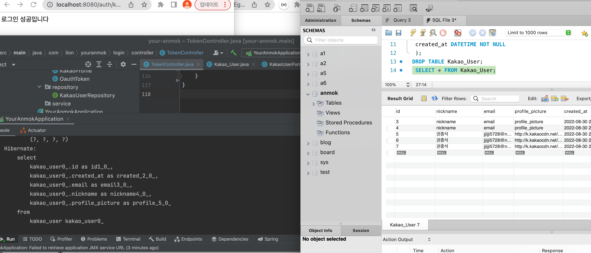
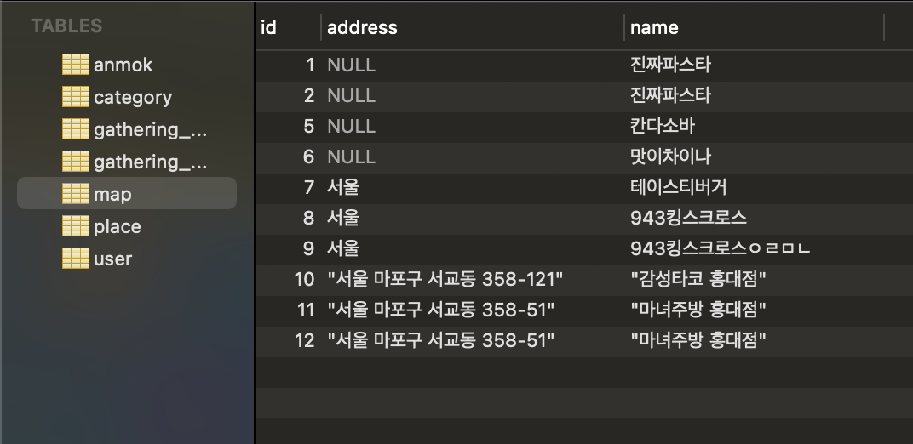
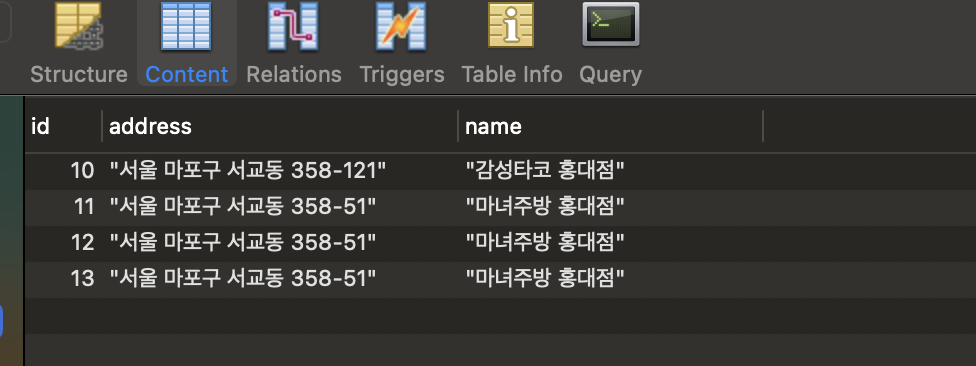
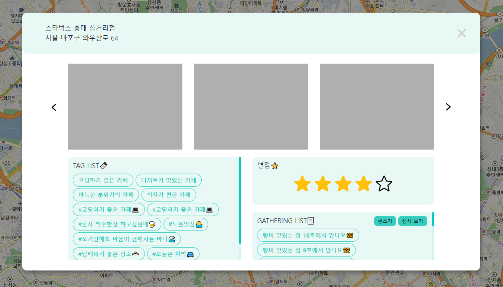
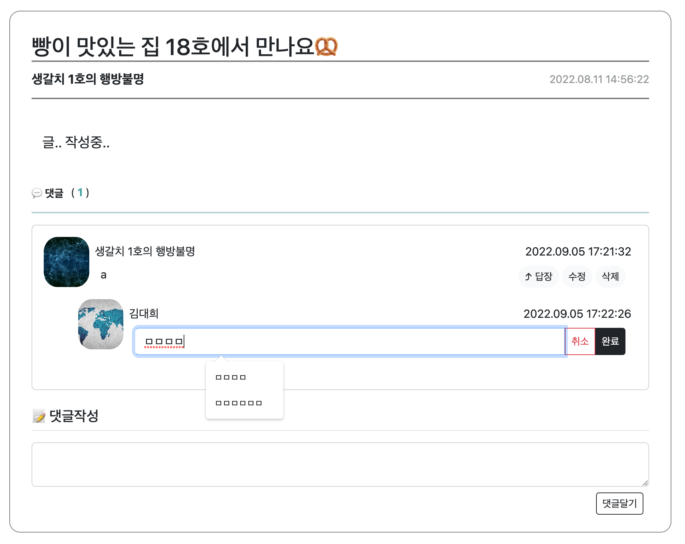
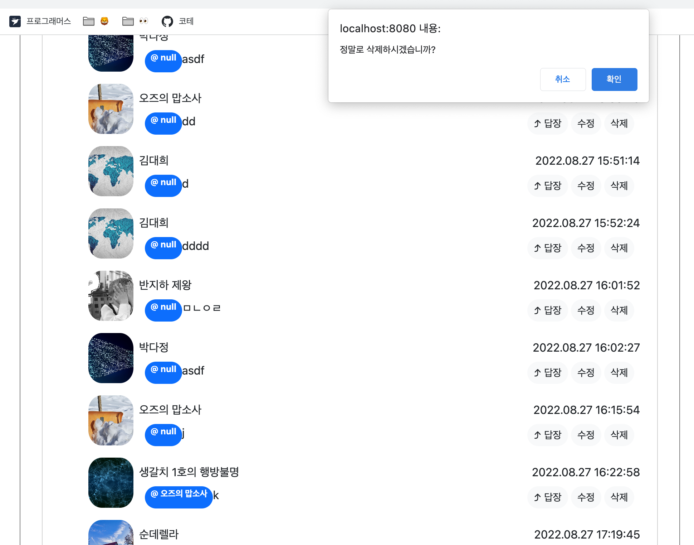

# [5주차] idea_13팀 진행상황 공유

 

## 📍 팀 구성원, 개인별 역할

- 권종석[팀장] : DB 설계, 카카오 로그인 구현
- 김아름 : 지도에서 장소 선택지 장소 관련 정보 팝업 구현
- 박다정 : 번개 모임 관련 페이지 구현
- 박중현 : 지도 구현
- 박정원 : 카테고리 페이지 구현

 

## 📍 팀 내부 회의 진행 회차 및 일자

13회차(2022.08.31)
14회차(2022.09.05)

 

## 📍 현재까지 개발 과정 요약 (최소 500자 이상)

> 💬 13회차

- ### 종석님

  - 로그인 성공, DB 저장 확인
  - 해야할 일 : DB 사용자 정보 여러명 되는지 확인, 필요한 로직 추가, 로그아웃, 불필요한 코드 리팩토링 필요

- ### 중현님

  
  
    - DB에 주소 데이터 추가 및 공백(white space) 전 문자까지만 데이터에 들어오는 버그 수정
    - 해야할 일 : DB에 등록된 장소를 마커로 표시하기
  
> 💬 14회차

- ### 종석님
    - 해야할 일 : main에 로그인 붙여넣기, Mypage 작업

- ### 정원님
  - 카테고리 박스 배경을 사진으로 설정
  - 추천 카테고리 생성
  - 로그인 시에 즐겨 찾기 해놓은 카테고리들이 우선적으로 뜨도록 쿼리 작성

- ### 아름님

  - DB에 저장된 별점에 따라 별점 박스에 별 채워지도록 작성
  - 태그 개수가 주어진 태그 박스 영역에 다 담기지 않으면 자동으로 스크롤 생성되도록 작성
  - 저장된 번개 게시물 리스트 중 장소 id가 일치하는 게시글을 모두 불러와 나열
  - 게시글 제목 클릭 시 해당 게시물의 상세 페이지로 이동
  - 게시물 최신순으로 나열, 스크롤 적용
  - 게시물 개수와 상관 없이 글쓰기, 전체 보기 버튼 생성

- ### 다정님

  - 댓글 수정 구현완료

  - 댓글 삭제 구현완료

 

## 📍 개발 과정에서 나왔던 질문 (최소 200자 이상)

> 💬 멘토님 코멘트
> 
> - 메인 지도 페이지 들어갔을 때 로고나 이름 표시가 필요할 것 같다
> - 로그인, 회원가입 버튼 색상 때문에 글씨가 잘 안보임
> - 프론트 작업은 제일 나중에 작업

## 📍 개발 결과물 공유

Github Repository URL: https://github.com/likelion-backendschool/your-anmok

 

## 📍 WBS 변동사항

https://docs.google.com/spreadsheets/d/11tfIgst-ps3tmqopmtfzQIW0vAkusEPWmxGlkHYzE_E/edit#gid=0
