# [5주차] idea_13팀 진행상황 공유

 

## 📍 팀 구성원, 개인별 역할

- 권종석[팀장] : DB 설계, 카카오 로그인 구현
- 김아름 : 지도에서 장소 선택지 장소 관련 정보 팝업 구현
- 박다정 : 번개 모임 관련 페이지 구현
- 박중현 : 지도 구현
- 박정원 : 카테고리 페이지 구현

 

## 📍 팀 내부 회의 진행 회차 및 일자

15회차(2022.09.13)

 

## 📍 현재까지 개발 과정 요약 (최소 500자 이상)

> 💬 15회차

- ### 종석님
  - 기존 이메일 존재하는지 확인 후 없으면 카카오 정보 가져와서 DB등록, 있으면 임시적으로 이메일이 존재한다는 메세지 띄워놓음
  - Kakao key를 따로 분류해서 노출되지 않도록 설정 → html쪽 어떻게 해야하는지 물어보기
  - Dev브랜치에서 로그인 merge후 충돌난 것 수정완료. 아직 `commit` 과 `push` 하지 않은 상태
 
  - 해야할 일 : 로그인이 되었을 때 메인 페이지로 redirect되게 설정하기 후 main에 push, mypage 관련 맡아야 할 부분 정원님과 상의

- ### 다정님
  1. 리스트
     - 카테고리 필터 여러개 선택 가능하게하기,
     - 이름, 주소 입력 후 검색 버튼 누를 시 ajax로 search요청 보내기, 값 받아와서  화면 다시 렌더링하기 완료
       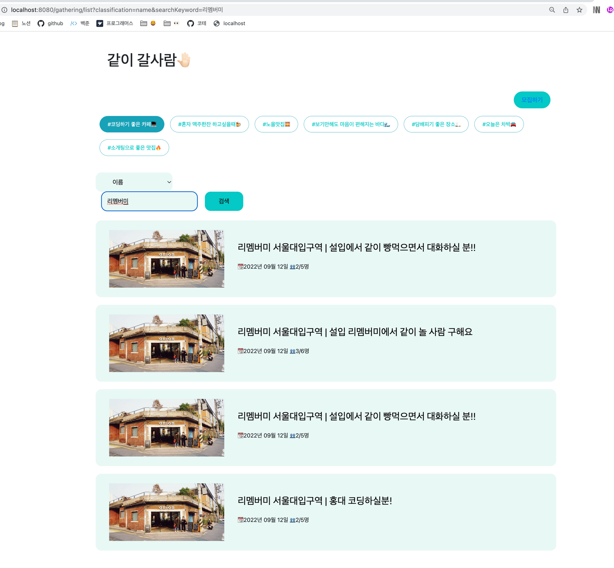

  2. 모집 글
     1. 폼 만들기 완료
     2. 장소 검색 시 선택 옵션 아래에 리스트 보여지도록 구현완료
     3. 등록 완료
     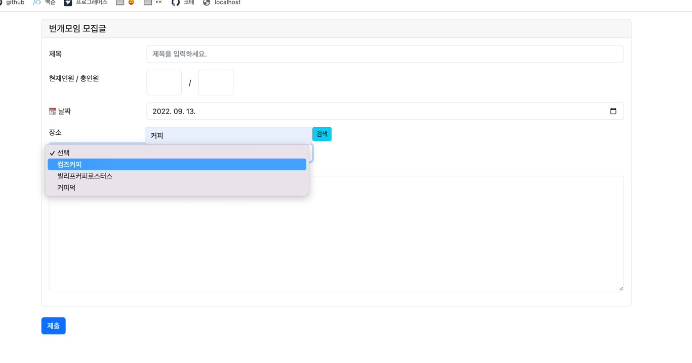
  
  3. 모집글 상세
  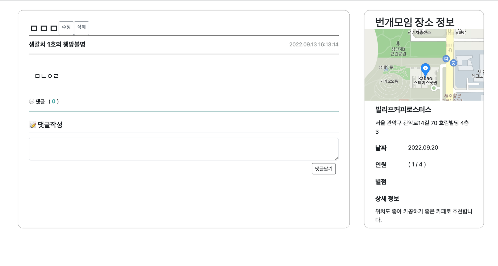
     1. 수정 기능 구현완료
     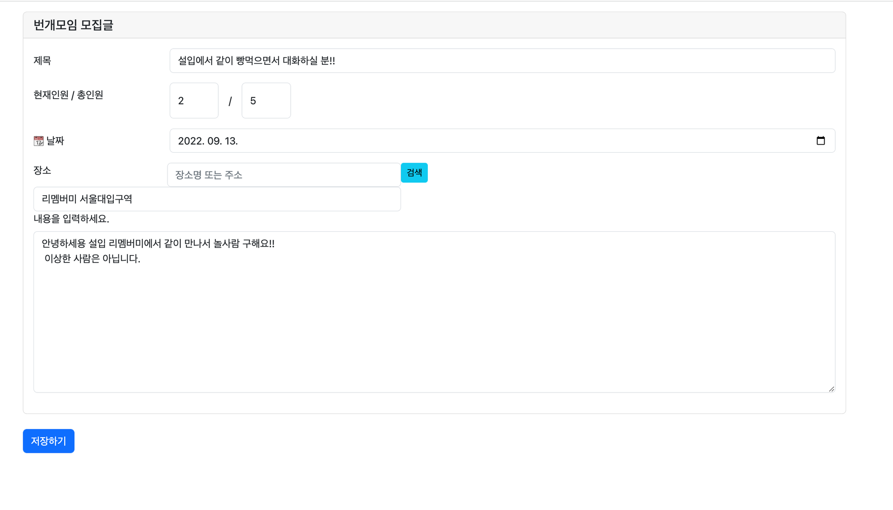
     2. 삭제 기능 구현완료
     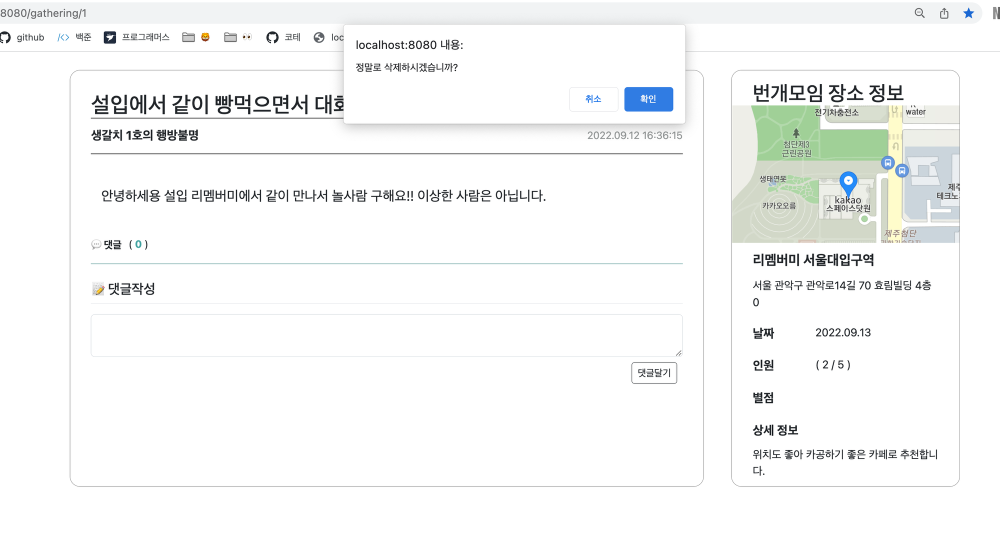

  해야할 일 :
  1. 카테고리 필터 검색기능 에러 수정
  2. 자잘자잘한 에러수정 
     
  

- ### 아름님
  - 장소 등록 팝업 생성 및 초안 작성
    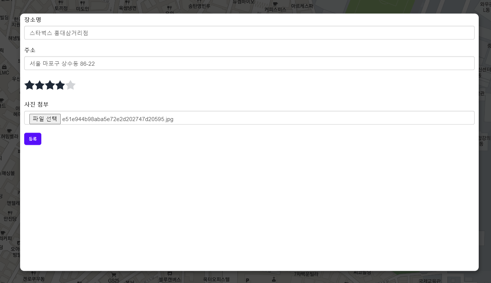
  - 다중 파일 업로드 기능 구현 
  - 장소, 장소 리뷰, 장소 이미지 구조 수정
  - 장소 등록 시 남길 수 있는 장소 리뷰(별점, 사진) 등 DB 등록
  
  해야할 일 : 
  1. 장소 상세 팝업에 장소 이미지 불러오기
  2. 장소 관련 erd 수정
     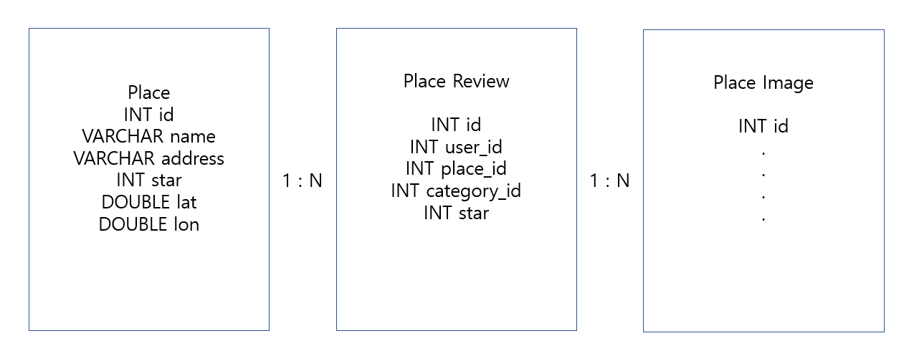
  

- ### 중현님
  - 좌측 슬라이드 메뉴 버튼 생성
    - 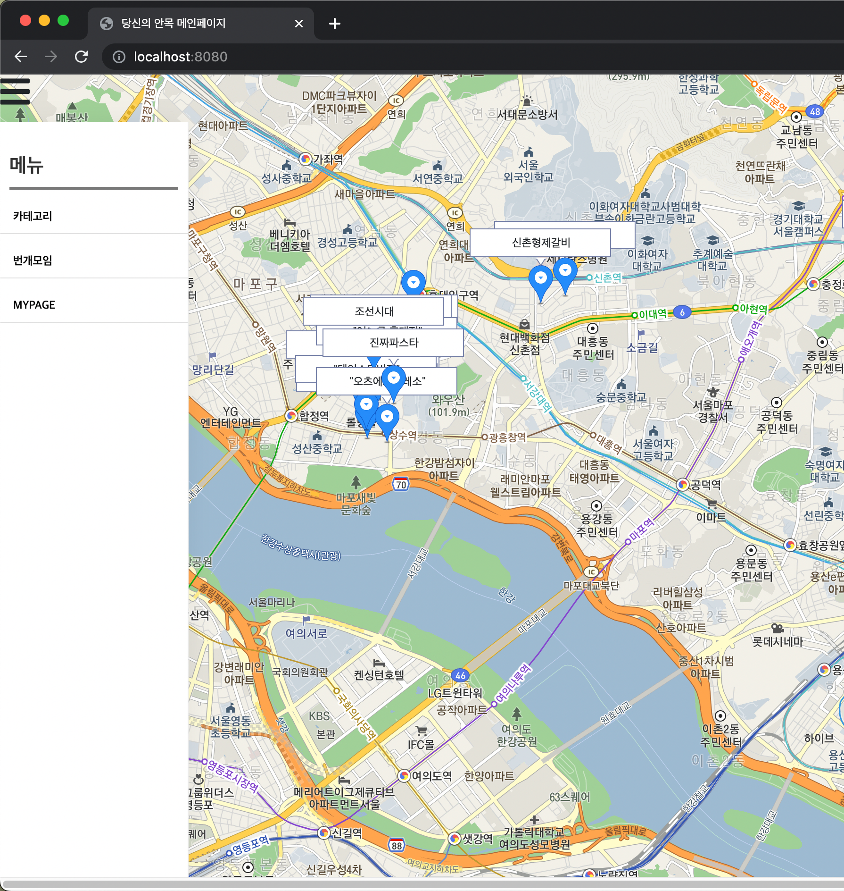
  - 검색을 서울 부분에 한정하여 검색하도록 수정
  - Map.html 기능별로 분리
    - 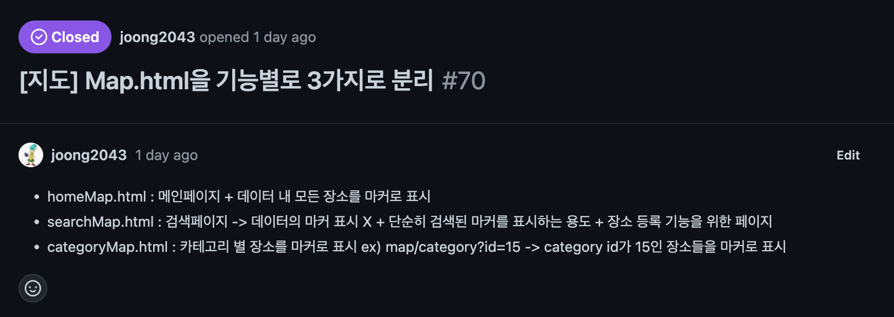
  - 장소등록 팝업버튼 클릭시 팝업 생성 + 팝업에 자동으로 이름/주소 입력
    - 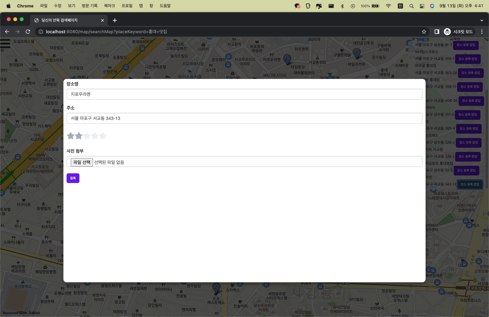
  - 장소 등록 버튼 클릭 시 place 테이블에 장소 데이터 저장

  해야 할 일
  1. 내위치 버튼 클릭 시 내 위치 주변 마커들 보여주기
  

- ### 정원님
  - 마이페이지에 해당 사용자가 즐겨 찾기 해놓은 카테고리 나열 & 즐겨 찾기 해제 기능 구현
  - 즐겨 찾기 관련 버그 수정 → 마이페이지에서 삭제 버튼 눌렀을 때 정상 동작하지 않는 버그
  - 해당 사용자가 쓴 번개모임, 댓글 리스팅 → 클릭 시 해당 번개 모임 게시글로 이동
  - CategoryController 메서드 리팩토링
    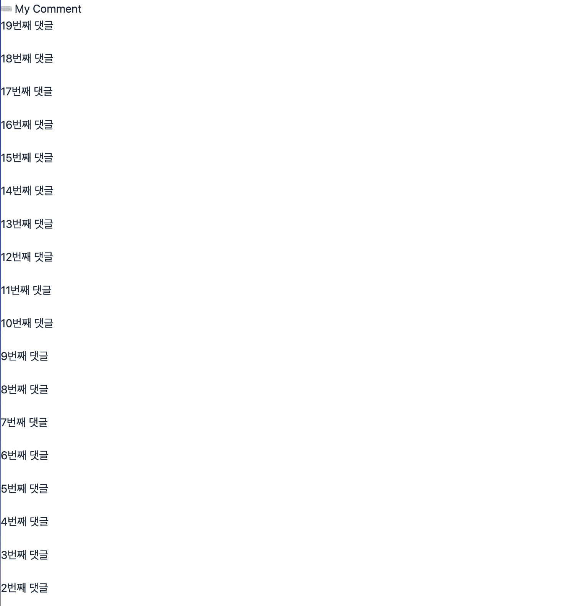

  해야할 일 :
  1. 로그인 연동 후 메서드 동작 확인
  2. 마이페이지 이미지, 닉네임 변경 관련 문제 상의 후 구현

## 📍 개발 과정에서 나왔던 질문 (최소 200자 이상)
1. place-category간 연결관계 질문 -> erd를 수정하기로 결론지음!

## 📍 개발 결과물 공유

Github Repository URL: https://github.com/likelion-backendschool/your-anmok

 

## 📍 WBS 변동사항

https://docs.google.com/spreadsheets/d/11tfIgst-ps3tmqopmtfzQIW0vAkusEPWmxGlkHYzE_E/edit#gid=0
