# [7주차] idea_13팀 진행상황 공유

 

## 📍 팀 구성원, 개인별 역할

- 권종석[팀장] : DB 설계, 카카오 로그인 구현
- 김아름 : 지도에서 장소 선택지 장소 관련 정보 팝업 구현
- 박다정 : 번개 모임 관련 페이지 구현
- 박중현 : 지도 구현
- 박정원 : 카테고리 페이지 구현

 

## 📍 팀 내부 회의 진행 회차 및 일자

16회차(2022.09.19)

 

## 📍 현재까지 개발 과정 요약 (최소 500자 이상)

> 💬 16회차

- ### 종석님
    - 카카오 유저 정보 created_at 칼럼 저장되지 않는 문제 해결
    - Dev에서 메인으로 코드 충돌 해결 후 머지
    - 현재 컨트롤러 코드를 서비스쪽으로 리펙토링 하는 작업시작

- ### 다정님
    1. 번개 메인 
        - 검색 버튼 화면 개선
          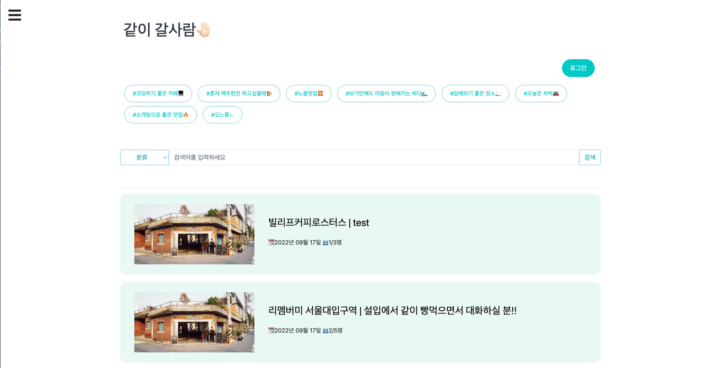
        - 사이드바 생성
          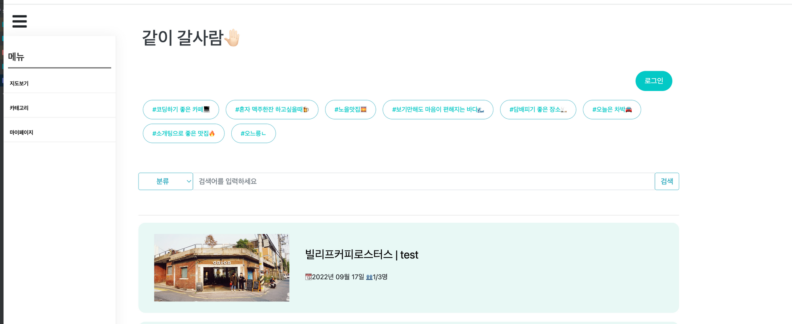
        - 로그인/로그아웃 화면 개선 (로그인 상태)
        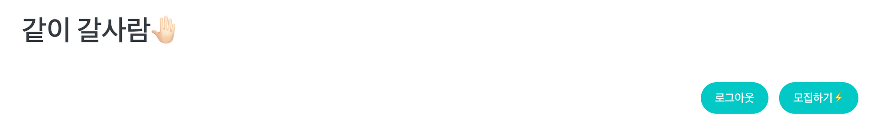
        - 로그인/로그아웃 화면 개선 (로그아웃 상태)
        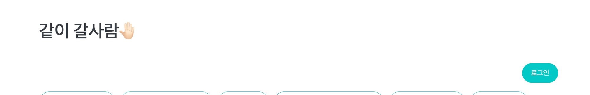
    
    2. 번개 상세
       - 내가 쓴 댓글, 글만 수정 및 삭제 가능
       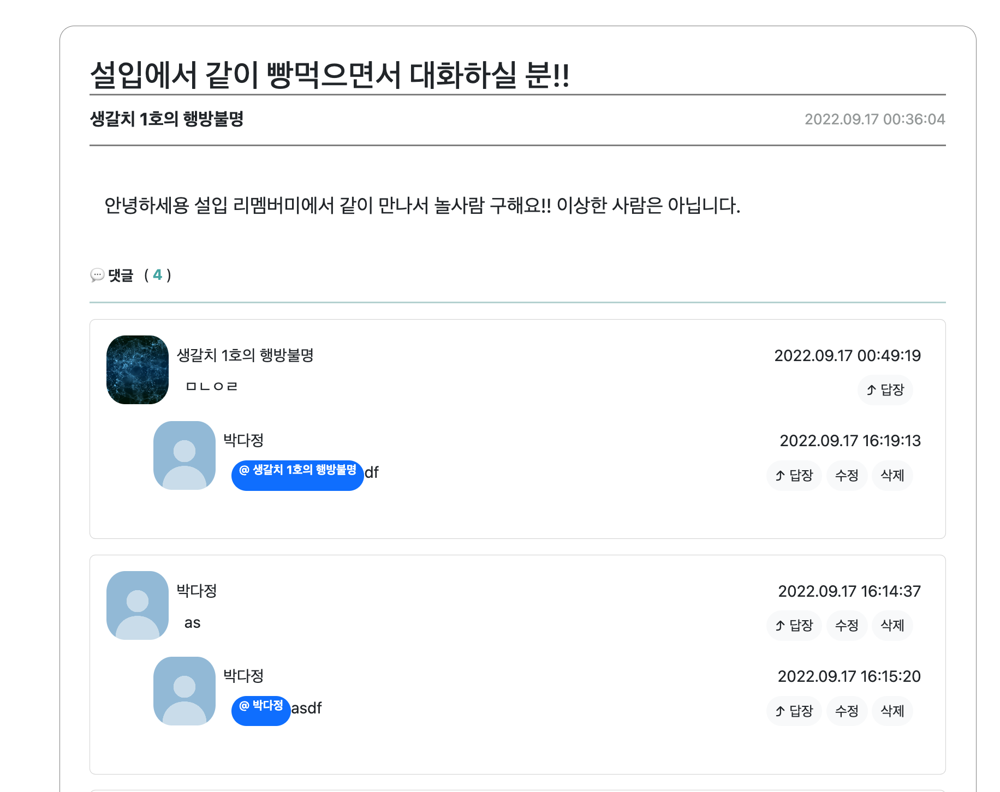
       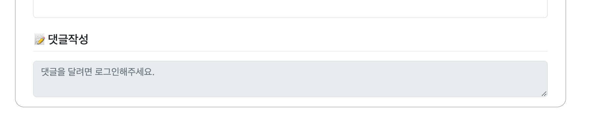
       - 검색 후 엔터 누를 시 폼 제출되는 버그 수정

  

- ### 아름님
    - 장소 등록 시 카테고리 선택 기능 추가
    - 카테고리 입력 시 이미 존재하는 카테고리 리스트 노출/사용자가 직접 입력하여 새로 추가 가능
       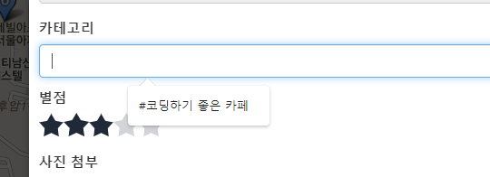
    - 장소 등록 팝업 CSS
       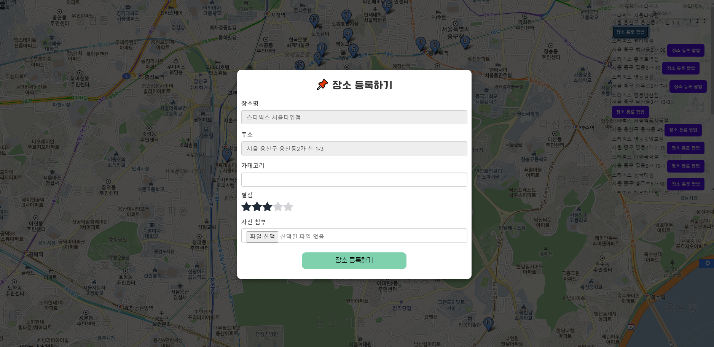
  
    
  해야할 일 :
  1. 상세 팝업 CSS

- ### 중현님
1. 상세정보 팝업 완성 → 이미지 슬라이더 해결

2. 메인페이지를 제일 인기 카테고리 → 1번 카테고리를 메인페이지화 하는 느낌입니다

3. 카테고리 페이지 마커 리스트 표시 → /category?id=15

- ### 정원님
1. 카테고리 추가 기능 구현
    - 중복 카테고리명 허용 X
    - confirm창으로 확인
    - 공백 허용 X
    - 등록되면 해당 카테고리가 추가된 창으로 이동
      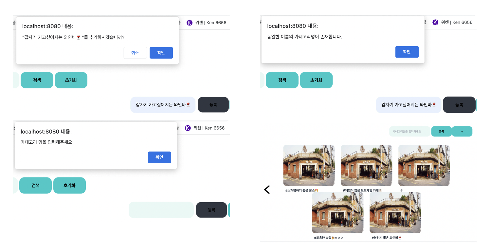

2. 시큐리티 일단 접근 모두 허용으로 설정해놓음. 각자 작업에 따라 url 시큐리티 컨피그에 추가하거나 어노테이션 사용해서 접근 권한 설정 필요
   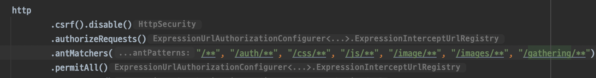

3. 로그인 유무에 따른 동작 구현
    - 로그인 된 사용자는 로그아웃, 마이페이지, 북마크 버튼 활성화
    - 로그아웃된 사용자는 북마크 기능 볼 수 없음, 로그인 버튼만 활성화
      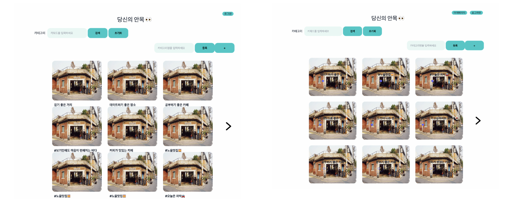

4. 로그인 유무에 따라 카테고리 정렬 다르게
    - 로그인이 되어 있으면 자신이 북마크한 카테고리 먼저
    - 로그아웃 되어 있으면 카테고리들의 전체 북마크 수를 기준으로 정렬

5. 닉네임 변경
    - 닉네임 변경 confirm창으로 확인
    - 공백 문자는 허용 X
    - 중복도 허용하지 말까요?
    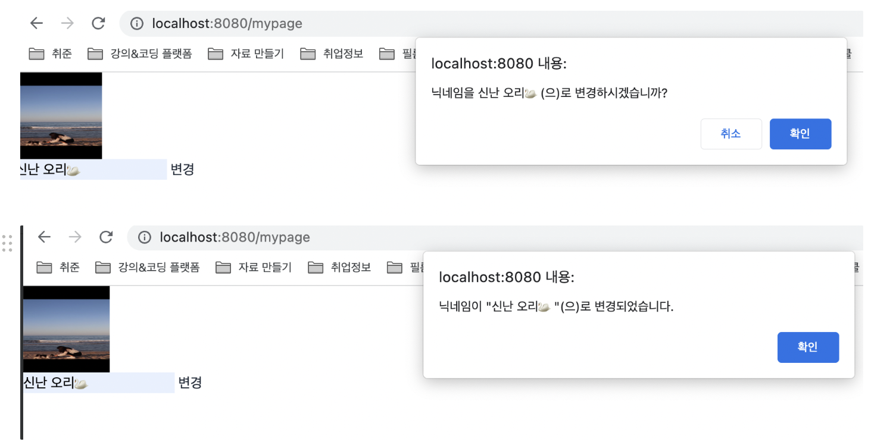

## 📍 개발 과정에서 나왔던 질문 (최소 200자 이상)

## 📍 개발 결과물 공유

Github Repository URL: https://github.com/likelion-backendschool/your-anmok

 

## 📍 WBS 변동사항

https://docs.google.com/spreadsheets/d/11tfIgst-ps3tmqopmtfzQIW0vAkusEPWmxGlkHYzE_E/edit#gid=0
