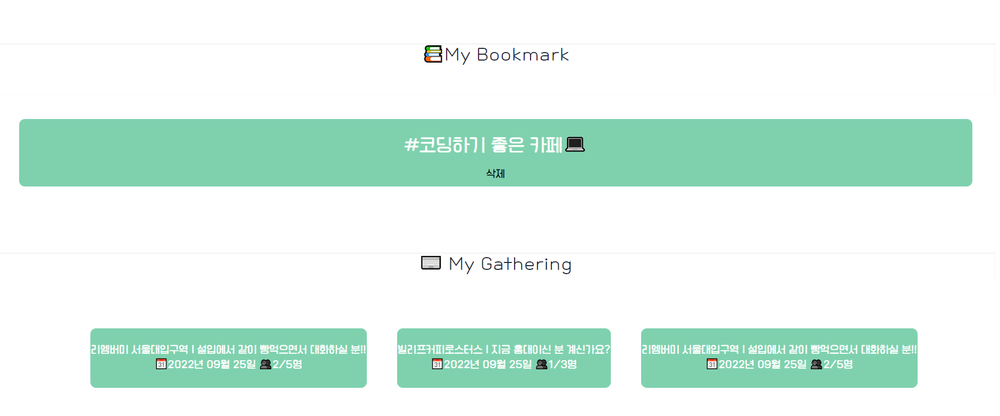
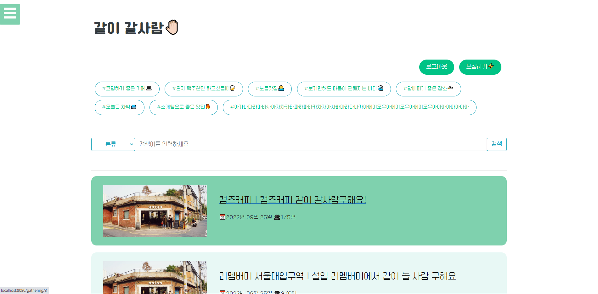
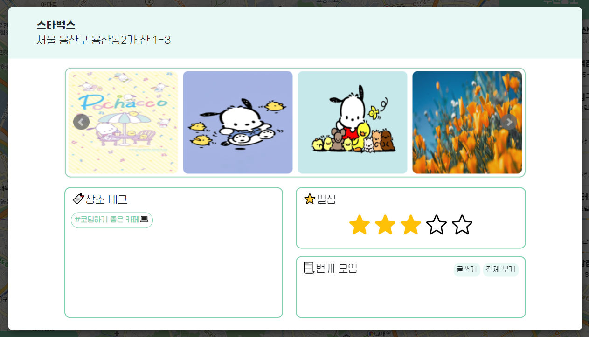
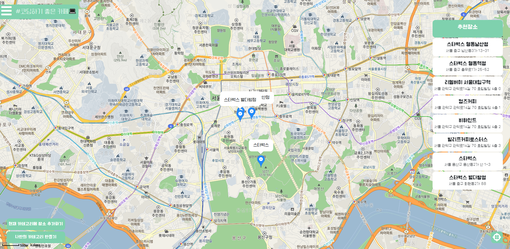
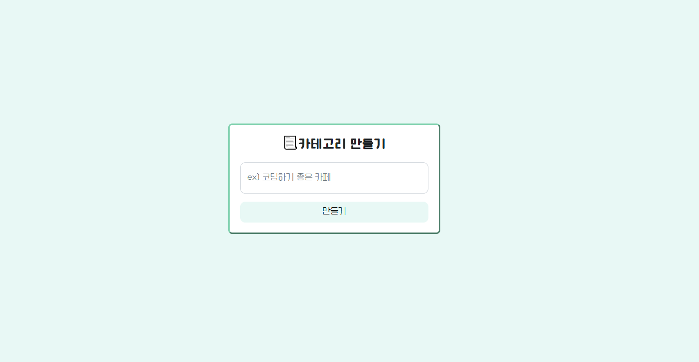
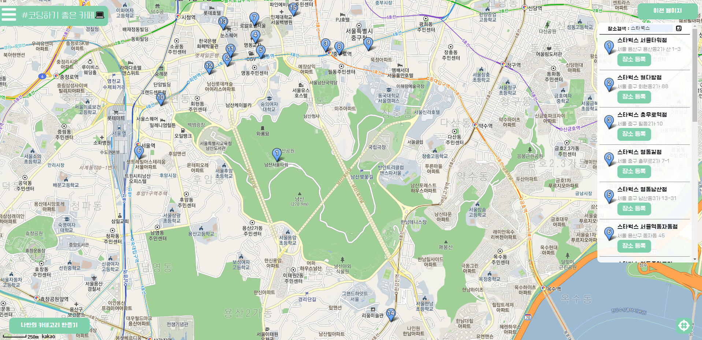
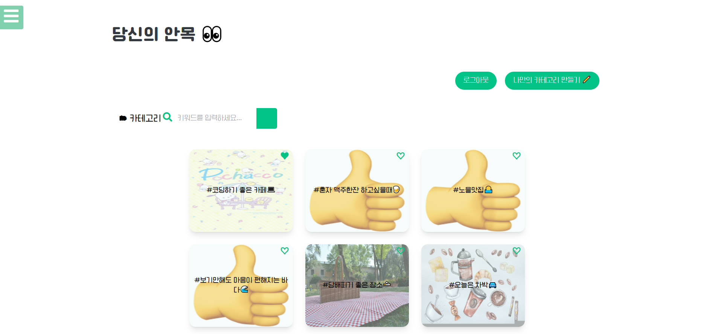

# [8주차] idea_13팀 진행상황 공유

 

## 📍 팀 구성원, 개인별 역할

- 권종석[팀장] : DB 설계, 카카오 로그인 구현
- 김아름 : 지도에서 장소 선택지 장소 관련 정보 팝업 구현
- 박다정 : 번개 모임 관련 페이지 구현
- 박중현 : 지도 구현
- 박정원 : 카테고리 페이지 구현

 

## 📍 팀 내부 회의 진행 회차 및 일자

17회차(2022.09.22) 
18회차(2022.09.25)

 

## 📍 현재까지 개발 과정 요약 (최소 500자 이상)

> 💬 17, 18회차

- ### 종석님
  
  - 로그인과 로그아웃 클릭하면 로그인 페이지로 한번 더 넘어가지 않고 바로 이동하도록
  - 로그인 컨트롤러,서비스 분리하기
  - 마이페이지 작업
  - 카카오 로그인 버튼으로 통일하기
    

- ### 다정님
  

  - 번개 게시물 박스 클릭 시 상세 이동
  - 번개 게시물 페이지 CSS 수정
  - 상세 화면 내부 지도 포커싱 오류 해결

- ### 아름님
    
  - 상세 팝업 이미지 슬라이더 오류 수정
  - 상세 팝업 CSS
  - 상세 팝업 기능 개선
      - 팝업 외부 클릭 시 팝업 닫힘 
      - 이미지 없을 때 안내 메세지
      - 팝업 내부 영역 분리

  - 지도 화면 CSS 분리 및 버튼, 장소 리스트 CSS
  
  

  - 카테고리 등록 페이지 생성 및 등록 처리

  

- ### 중현님
  
  
  - 마커에 커스텀 오버레이 추가
  - 카테고리 맵 페이지 우측에 장소 리스트 표시
  - 검색화면 CSS 수정
  - 현재 위치 버튼 버그 수정

- ### 정원님
  

  - 카테고리 페이지 CSS
  - 카테고리 배경 이미지 랜덤으로 가져오도록 설정
  - 카테고리 배경 default 이미지 설정
  - 로그인 여부에 따른 카테고리 정렬 수정

## 📍 개발 과정에서 나왔던 질문 (최소 200자 이상)
로그인 성공 이후 나타나는 페이지를 이전페이지로 수정

## 📍 개발 결과물 공유

Github Repository URL: https://github.com/likelion-backendschool/your-anmok

 

## 📍 WBS 변동사항

https://docs.google.com/spreadsheets/d/11tfIgst-ps3tmqopmtfzQIW0vAkusEPWmxGlkHYzE_E/edit#gid=0
